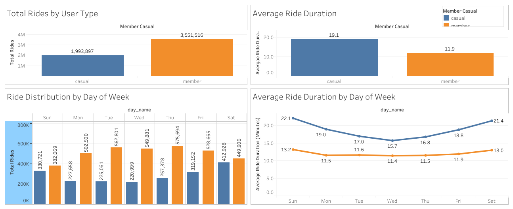

# 📊 Data Analytics Portfolio

Welcome to my data analytics portfolio showcasing end-to-end projects focused on transforming raw data into actionable business insights.

---

## 🚴 Cyclistic Bike-Share Analysis

📌 **Goal:** Analyze user behavior to improve membership conversion

🔍 **Key Highlights:**

* Analyzed 5.5M+ ride records using SQL (BigQuery)
* Identified behavioral differences between casual riders and members
* Built Tableau dashboard to visualize usage trends

🖼️ **Dashboard Preview:**

👉 [View Full Project](cyclistic-bike-share-analysis)

---

## 💊 Pharmaceutical Sales Analysis

📌 **Goal:** Identify revenue drivers and market trends

🔍 **Key Highlights:**

* Analyzed global pharmaceutical sales data (2020–2025)
* Created revenue KPIs and time-series analysis
* Built Power BI dashboard for business insights

🖼️ **Dashboard Preview:**

👉 [View Full Project](pharma-sales-analysis)

---

## 🛠 Skills Demonstrated

* SQL (data cleaning, aggregation, analysis)
* Data Visualization (Tableau, Power BI)
* Data Cleaning & Feature Engineering
* Business Insight Generation

---

## 📬 Contact

* LinkedIn: https://www.linkedin.com/in/nitisha-patange-357340199/
* Email: [nitishapatange1997@gmail.com](mailto:nitishapatange1997@gmail.com)

---

⭐ If you find this useful, feel free to star the repository!
