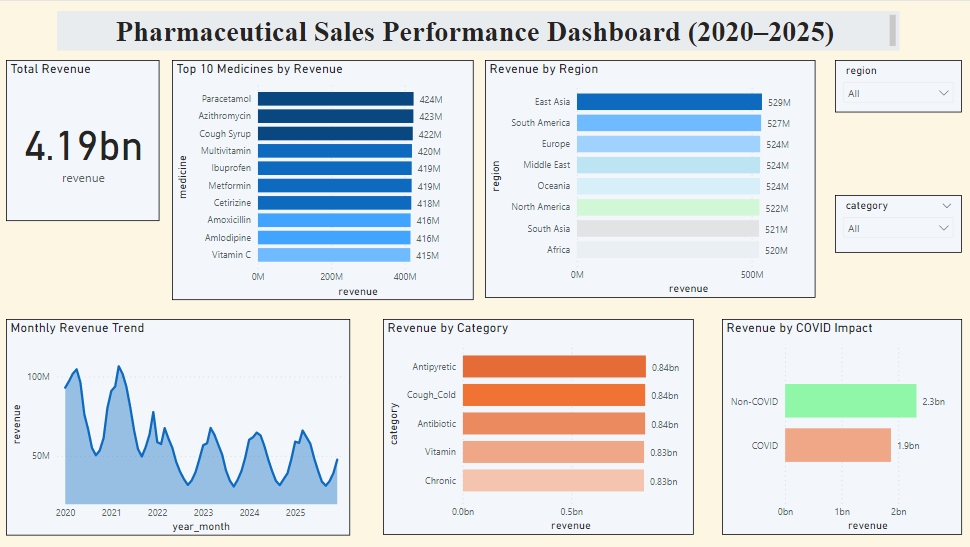

# 💊 Pharmaceutical Sales Analysis

## 📌 Overview

This project analyzes global pharmaceutical sales data to identify key revenue drivers, product performance, and market trends.

---

## 🎯 Business Problem

What factors drive pharmaceutical sales performance across regions, products, and time?

---

## 🛠 Tools & Technologies

* SQL (MySQL)
* Power BI
* Excel

---

## 📊 Dashboard

---

## 📄 Full Case Study

[View Detailed Analysis](docs/case-study-pharma.docx)

---

## 📂 Project Structure

* SQL Queries → /sql
* Dataset Description → /data
* Visualizations → /visuals
* Power BI File → /powerbi
* Documentation → /docs

---

## 🔍 Data Processing Steps

* Validated and structured dataset for analysis
* Created revenue as a key performance metric
* Generated time-based features for trend analysis
* Prepared data for visualization in Power BI

---

## 📈 Key Insights

* Total revenue reached approximately $4.19B
* Revenue is relatively evenly distributed across regions
* Certain medicines significantly outperform others
* COVID period showed a decline in overall revenue

---

## 💡 Recommendations

* Focus on high-performing medicines to maximize revenue
* Maintain a diversified product portfolio
* Strengthen supply chain resilience
* Monitor market trends to adapt strategies

---

## 🚀 Conclusion

The analysis highlights critical factors influencing pharmaceutical sales performance. These insights can help businesses optimize product strategy, improve operational efficiency, and drive sustainable growth.

---
